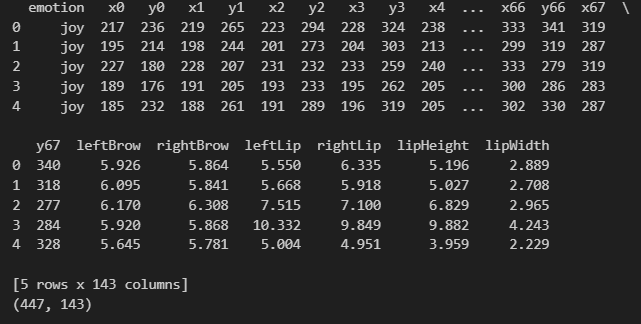
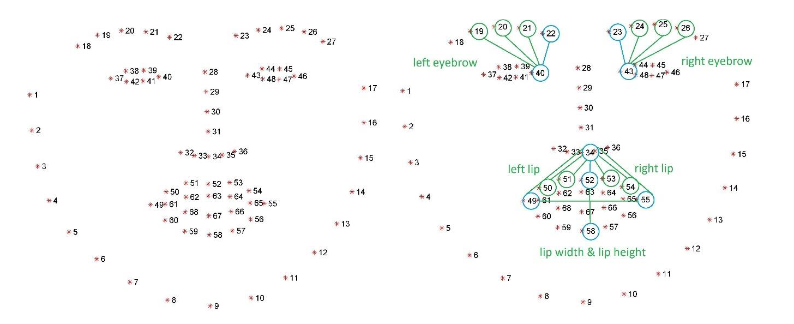
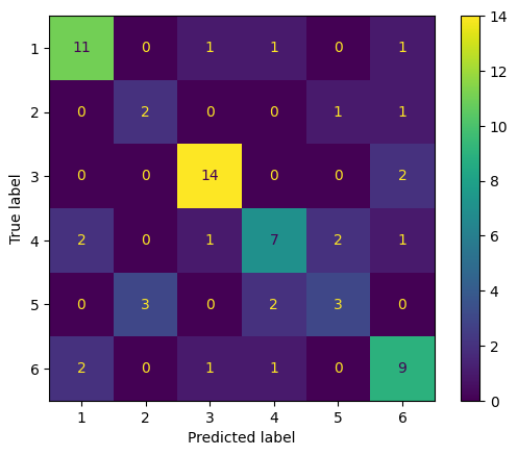

# Emotion-Recognition
This project involved being given a dataset that consisted of a set of 67 x & y coordinates that corresponded to different points on human faces, as well as important measurements such the distance between both sides of the mouth and how open it is.
  

 
The image below shows the corresponding point that each coordinate corresponds to and the pre-computed measurements, however these measurements proved to be unhelpful for the model. To solve this, the default measurements were removed and new ones were created by finding the Euclidian distance between the corner of each eye as well as each point on that eye's eyebrow, how open each eye is, and more accurate measurements on the mouth. This allowed for greater understanding of the most expressive areas of the face.
 

  
The final confusion matrix is shown below, with most emotions being classified correclty consistently, with the exception of emotion 2 (Fear) and emotion 5 (Disgust). This is likely due to the fact that these emotions have similar expressions that are being shown, so the model was not able to accurately create a distinction with one another.

